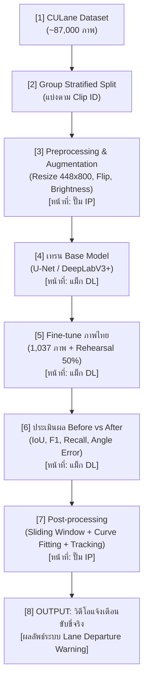

# Lane Detection and Tracking for Thai Roads 🚗💨

ระบบตรวจจับและติดตามเส้นช่องทางจราจรสำหรับสภาพถนนในประเทศไทย โดยประยุกต์ใช้เทคนิค **Computer Vision (Image Processing)** และ **Deep Learning (U-Net / DeepLabV3+)** ทำงานร่วมกันตามลำดับขั้นตอน (Pipeline)

---

## 🔄 แผนผังกระบวนการทำงาน (End-to-End Pipeline)

กระบวนการพัฒนาและประมวลผลแบ่งออกเป็น 8 ขั้นตอนหลัก พร้อมการแบ่งหน้าที่รับผิดชอบชัดเจน:



---

## 👥 การแบ่งหน้าที่รับผิดชอบ (Team Roles)

| ส่วนงาน | ผู้รับผิดชอบหลัก | ขั้นตอนใน Pipeline | ขอบเขตหน้าที่ |
|---|:---:|:---:|---|
| **Image Processing (IP)** | **ปั๊ม** | ขั้นตอนที่ 3, 7, 8 | • Data Preprocessing & Augmentation<br>• Post-processing (Sliding Window, Curve Fitting, Tracking)<br>• สร้างวิดีโอผลลัพธ์และระบบแจ้งเตือนขับขี่จริง |
| **Deep Learning (DL)** | **แม็ก** | ขั้นตอนที่ 2, 4, 5, 6 | • Group Stratified Split ป้องกัน Data Leakage<br>• เทรน Base Model (CULane Dataset 61k ภาพ)<br>• Fine-tune บนถนนไทย (1,037 ภาพ) พร้อม Rehearsal 50% กันลืมกลางคืน<br>• ประเมินผลเปรียบเทียบ Before vs After (IoU, F1, Recall, Slope) |

---

## 📂 โครงสร้างโปรเจกต์ (Project Structure)

```text
Project-lane-detection-and-Tracking/
├── image_processing/             # 🛠️ ส่วนประมวลผลภาพ (Traditional CV & Post-processing) [ปั๊ม : IP]
│   ├── edge_detection.py         # การหาขอบภาพและกรองสี (HLS/HSV/Sobel)
│   ├── perspective.py            # การทำ Bird's-Eye View
│   ├── lane_tracker.py           # Sliding Window และการค้นหาเส้นเลน
│   ├── lane_processor.py         # ระบบจัดการความเสถียรของเส้นเลน (Smoothing)
│   └── main.py                   # ไฟล์หลักสำหรับรันระบบ CV
│
├── cardashcam_train_model/       # 🧠 ส่วนโมเดลเชิงลึกและการทดลอง [แม็ก : DL]
│   ├── PIPELINE.md               # รายละเอียดแมปไฟล์เข้ากับ 8 ขั้นตอน
│   ├── HANDOFF_IP.md             # ข้อกำหนดการส่งต่อ Mask ร่วมกันระหว่าง DL และ IP
│   ├── dataset.py                # DataLoader พร้อม Data Augmentation
│   ├── finetune_thai.py          # สคริปต์หลักสำหรับเทรนและ Fine-tune โมเดล
│   ├── slope_metrics.py          # เครื่องมือวัดมุมองศาความชันของเส้นเลน (Slope Error)
│   ├── eval_masks.py             # สคริปต์วัดผล Mask ระดับพิกเซลและมุมองศา
│   ├── plot_thai_examples.py     # สคริปต์พล็อตภาพเปรียบเทียบ Before vs After
│   ├── notebooks/                # สมุดทดลอง Jupyter (เทรน CULane, Fine-tune, วัดผล)
│   ├── scripts/                  # สคริปต์วิเคราะห์และสร้างรายงานผลการทดลอง
│   └── thai_road_lane/           # รายชื่อชุดข้อมูลไทย (Train, Val, Test)
│
├── tools/                        # 🔧 เครื่องมือเสริม
│   └── extract_frames.py         # สกัดภาพจากวิดีโอเพื่อทำ Dataset
│
├── requirements.txt              # รายการแพ็กเกจที่ต้องติดตั้ง
└── README.md                     # เอกสารแนะนำโปรเจกต์
```

---

## 📊 ผลการประเมินการ Fine-tune บนถนนไทย (Before vs After)

ผลการทดสอบบนชุดภาพถนนไทย (191 ภาพข้อสอบ ที่โมเดลไม่เคยเห็นตอนเทรน):

| สภาพถนน | ก่อน Fine-tune (Zero-shot) IoU | หลัง Fine-tune (DL) IoU | ก่อน F1 | หลัง F1 | การเปลี่ยนแปลง |
|---|:---:|:---:|:---:|:---:|:---:|
| **ทางตรง (Normal)** | 0.375 | **0.544** | 0.523 | **0.705** | ดีขึ้นชัดเจน (+35%) |
| **ทางโค้ง (Curve)** | 0.183 | **0.196** | 0.280 | **0.328** | ตรวจจับเส้นโค้งได้แม่นยำขึ้น |
| **กลางคืน (Night)** | 0.336 | **0.239** | 0.448 | **0.386** | รักษาทิศทางด้วย Rehearsal |
| **ภาพรวม (ALL)** | 0.354 | **0.470** | 0.523 | **0.640** | **IoU เพิ่มขึ้น +33%** |

---

## 🚀 เริ่มต้นใช้งาน (Getting Started)

### 1. การติดตั้งสภาพแวดล้อม
```bash
pip install -r requirements.txt
```

### 2. รันการประมวลผลฝั่ง Image Processing
```bash
python image_processing/main.py
```

### 3. รันการประเมินผลฝั่ง Deep Learning
```bash
cd cardashcam_train_model
python eval_masks.py --pred-dir /path/to/masks --tag dl_evaluation
```

---

## 🎓 โครงการพัฒนา
* **ผู้จัดทำ**: ทีมพัฒนาโครงงานตรวจจับและติดตามเส้นช่องทางจราจร (Senior Project)
* **เอกสารขั้นตอนละเอียด**: อ่านเพิ่มเติมได้ที่ [cardashcam_train_model/PIPELINE.md](cardashcam_train_model/PIPELINE.md)
