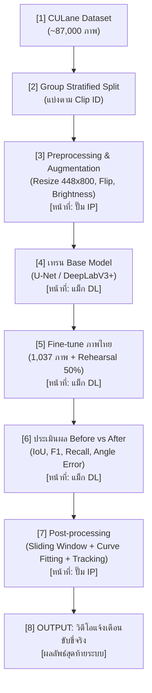

# Pipeline การตรวจจับและติดตามเส้นช่องทางจราจร (Lane Detection & Tracking)

> เอกสารสรุปขั้นตอนการทำงานและตำแหน่งไฟล์ในโปรเจกต์ อ้างอิงตามลำดับแผนผัง 8 ขั้นตอน

---

## สรุปการเชื่อมโยงไฟล์ตามขั้นตอน (Pipeline File Mapping)

| ขั้นตอนในแผนผัง | ผู้รับผิดชอบ | ไฟล์โค้ด / สคริปต์หลัก | ไฟล์ผลลัพธ์ / ข้อมูลที่เกี่ยวข้อง |
|---|:---:|---|---|
| **1. CULane Dataset** | - | - | `/home/jovyan/shared/donut/CarDashCam/CULane` |
| **2. Group Stratified Split** | แม็ก (DL) | [scripts/make_thai_subsets.py](file:///home/jovyan/cardashcam_train_model/scripts/make_thai_subsets.py) | [thai_road_lane/train_list.csv](file:///home/jovyan/cardashcam_train_model/thai_road_lane/train_list.csv) [thai_road_lane/val_list.csv](file:///home/jovyan/cardashcam_train_model/thai_road_lane/val_list.csv) [thai_road_lane/test_list.csv](file:///home/jovyan/cardashcam_train_model/thai_road_lane/test_list.csv) [data_subsets/](file:///home/jovyan/cardashcam_train_model/data_subsets/) |
| **3. Preprocessing & Augmentation** | ปั๊ม (IP) | [dataset.py](file:///home/jovyan/cardashcam_train_model/dataset.py) (`_augment_tensor`) | [scripts/check_annotation_style.py](file:///home/jovyan/cardashcam_train_model/scripts/check_annotation_style.py) |
| **4. เทรน Base Model** | แม็ก (DL) | [notebooks/train_unet_resnet34_imagenet.ipynb](file:///home/jovyan/cardashcam_train_model/notebooks/train_unet_resnet34_imagenet.ipynb) | [models/best_model_resnet50_ssl_bs16_ep30.pth](file:///home/jovyan/cardashcam_train_model/models/) [results/training/](file:///home/jovyan/cardashcam_train_model/results/training/) [results/evaluate/](file:///home/jovyan/cardashcam_train_model/results/evaluate/) |
| **5. Fine-tune ภาพไทย** | แม็ก (DL) | [finetune_thai.py](file:///home/jovyan/cardashcam_train_model/finetune_thai.py) [notebooks/finetune_thai.ipynb](file:///home/jovyan/cardashcam_train_model/notebooks/finetune_thai.ipynb) [slope_loss.py](file:///home/jovyan/cardashcam_train_model/slope_loss.py) [scripts/run_datasize.py](file:///home/jovyan/cardashcam_train_model/scripts/run_datasize.py) | [models/thai_ft_rh_s1_best_f1.pth](file:///home/jovyan/cardashcam_train_model/models/) (โมเดลดีสุด) [results/thai/history_ft_rh_s1.csv](file:///home/jovyan/cardashcam_train_model/results/thai/) |
| **6. ประเมินผล Before vs After** | แม็ก (DL) | [eval_masks.py](file:///home/jovyan/cardashcam_train_model/eval_masks.py) [slope_metrics.py](file:///home/jovyan/cardashcam_train_model/slope_metrics.py) [plot_thai_examples.py](file:///home/jovyan/cardashcam_train_model/plot_thai_examples.py) [scripts/eval_retention.py](file:///home/jovyan/cardashcam_train_model/scripts/eval_retention.py) [scripts/analyze_night.py](file:///home/jovyan/cardashcam_train_model/scripts/analyze_night.py) [scripts/make_datasize_report.py](file:///home/jovyan/cardashcam_train_model/scripts/make_datasize_report.py) [notebooks/evaluate_metrics_comparison.ipynb](file:///home/jovyan/cardashcam_train_model/notebooks/evaluate_metrics_comparison.ipynb) | [results/thai/REPORT_THAI.md](file:///home/jovyan/cardashcam_train_model/results/thai/REPORT_THAI.md) [results/thai/REPORT_NIGHT.md](file:///home/jovyan/cardashcam_train_model/results/thai/REPORT_NIGHT.md) [results/thai/REPORT_DATASIZE.md](file:///home/jovyan/cardashcam_train_model/results/thai/REPORT_DATASIZE.md) [results/thai/comparison_three_methods.png](file:///home/jovyan/cardashcam_train_model/results/thai/comparison_three_methods.png) |
| **7. Post-processing** | ปั๊ม (IP) | [eval_masks.py](file:///home/jovyan/cardashcam_train_model/eval_masks.py) (ตัววัดผล Mask ร่วมกัน) | [HANDOFF_IP.md](file:///home/jovyan/cardashcam_train_model/HANDOFF_IP.md) |
| **8. OUTPUT: วิดีโอแจ้งเตือน** | ปั๊ม + แม็ก | - | [results/frames/](file:///home/jovyan/cardashcam_train_model/results/frames/) |

---

## รายละเอียดแต่ละขั้นตอน

### ขั้นที่ 1: CULane Dataset
* **ข้อมูล**: ชุดข้อมูลขนาดใหญ่จากจีน ~87,000 ภาพ (Train 61,183 ภาพ)
* **การใช้งาน**: ใช้เป็นความรู้ตั้งต้น (Pretrain) เพื่อให้โมเดลเข้าใจโครงสร้างเส้นเลน

### ขั้นที่ 2: Group Stratified Split ตาม Clip ID
* **วัตถุประสงค์**: แยกข้อมูล Train (749), Val (97), Test (191) โดยตัดเป็นรายคลิปวิดีโอ ป้องกันปัญหา Data Leakage (ภาพจากคลิปเดียวกันหลุดไปอยู่ทั้งข้อสอบและชุดฝึก)
* **สคริปต์**: `scripts/make_thai_subsets.py`

### ขั้นที่ 3: Preprocessing & Data Augmentation (หน้าที่ปั๊ม : IP)
* **การประมวลผลภาพ**: ย่อขนาดภาพเป็น $448 \times 800$ พิกเซล (หาร 32 ลงตัวตามสถาปัตยกรรมโครงข่าย)
* **Augmentation**: สุ่มพลิกซ้าย-ขวา 50% และปรับความสว่าง 30% เฉพาะชุด Train (ใน `dataset.py`)

### ขั้นที่ 4: เทรน Base Model (หน้าที่แม็ก : DL)
* **สถาปัตยกรรม**: U-Net (ResNet34, ResNet50 SSL) และ DeepLabV3+
* **ผลลัพธ์**: ได้ Base Weights บนถนนจีน เช่น `models/best_model_resnet50_ssl_bs16_ep30.pth` (F1 0.692)

### ขั้นที่ 5: Fine-tune ด้วย Thai Road Dataset 1,037 ภาพ (DL)
* **การฝึกต่อ**: ใช้ภาพไทย 749 ภาพฝึกต่อจาก Base Model ด้วย Learning Rate ต่ำ ($1 \times 10^{-5}$)
* **เทคนิค Rehearsal 50%**: ผสมข้อมูล CULane 50% ในแต่ละ Batch เพื่อป้องกันโมเดลลืมการขับขี่กลางคืน (Catastrophic Forgetting)
* **โมเดลที่แนะนำ**: `models/thai_ft_rh_s1_best_f1.pth`

### ขั้นที่ 6: ประเมินผล Before vs After Fine-tune (IoU / F1)
* **ตัวชี้วัด**: วัดทั้งความทับซ้อน (IoU, F1, Recall) และความถูกต้องของทิศทาง (มุมความชัน Slope Error)
* **ผลลัพธ์สรุป (191 ภาพ Test)**:
  * **Before (Zero-shot)**: IoU 0.354, F1 0.523, มุมคลาด 1.90°
  * **After (Fine-tune)**: **IoU 0.470**, **F1 0.640**, มุมคลาด 2.01°, Recall 0.856

### ขั้นที่ 7: Post-processing (หน้าที่ปั๊ม : IP)
* **การทำงาน**: ฝั่ง IP นำ Binary Mask (0 หรือ 255) ที่ได้จาก DL ไปทำ Sliding Window, ลากเส้น Polynomial Curve Fitting และ Tracking เส้นต่อเนื่องระหว่างเฟรม
* **การวัดผลร่วม**: วัดผล Mask ของ IP เทียบกับ DL ด้วยสคริปต์ `eval_masks.py` (กติกาตาม `HANDOFF_IP.md`)

### ขั้นที่ 8: OUTPUT: วิดีโอแจ้งเตือนขับขี่จริง
* **ผลลัพธ์ระบบ**: แสดงภาพวิดีโอพร้อมระบุเส้นเลนแบบ Overlay และส่งสัญญาณเตือนเมื่อรถเริ่มเบี่ยงออกนอกเลน (Lane Departure Warning)
